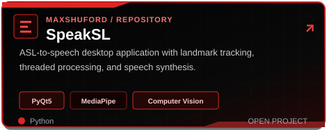
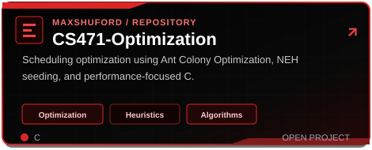
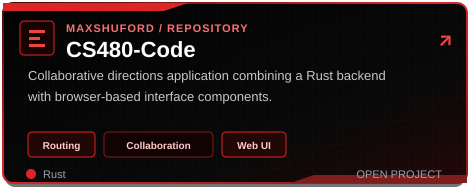
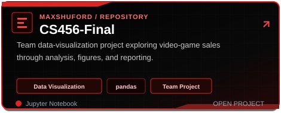
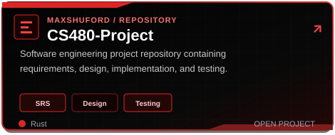
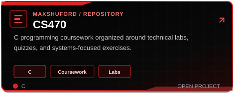
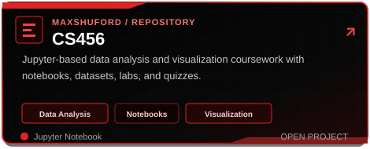

Computer Science graduate from **Central Washington University**
**Software Engineering, Computer Vision, Machine Learning, Systems, and Optimization**.

## About Me

- 2026 Computer Science graduate from Central Washington University
- Collaborated on **SpeakSL**, an ASL-to-speech desktop application
- Experience with multithreading, modular integration, optimization, and desktop packaging
- Interested in Java/RuneLite plugins debugging, and building helpful software

## Technology Stack

### Languages

### Frameworks, Applications & APIs

### Machine Learning & Computer Vision

### CI/CD, Version Control & Delivery

Branch-based development, pull requests, build automation, application packaging, and release preparation.

### Core Engineering

### Currently Expanding

## Featured Projects

 

<strong>Additional Coursework Repositories</strong>

 

 

## GitHub Activity

### Open to software development opportunities and technical collaboration

**Software Engineering · Computer Vision · Machine Learning · Systems · Cybersecurity**

